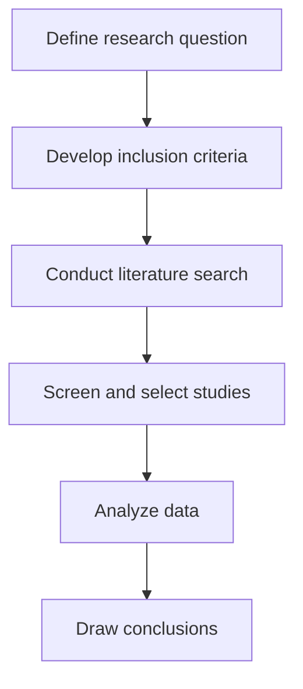

---
tags:
- gpt
---
### Overview: Creating Flowcharts and Diagrams with ChatGPT and Draw.io

This process uses **ChatGPT** to generate steps for a process and then transforms these steps into a flowchart using **draw.io**. Here's how you can create flowcharts for research, presentations, or personal use.

---

### Step-by-Step Instructions

1. **Generate the Steps with ChatGPT**:
   - Ask ChatGPT to provide a list of steps for a process (e.g., conducting a systematic literature review). For example:
     ```
     "Please provide the steps needed to create a systematic literature review."
     ```
   - ChatGPT will generate a detailed list of steps, such as:
     1. Define research question
     2. Develop inclusion criteria
     3. Conduct literature search
     4. Screen and select studies
     - And so on...

2. **Request ChatGPT to Create a Flowchart**:
   - To convert the steps into a flowchart, give ChatGPT this prompt:
     ```
     "Please create a flowchart representing the process of conducting a systematic literature review incorporating the above steps. Ensure related steps (like conducting literature search and screening selection) are placed side by side."
     ```
   - ChatGPT will generate a **Mermaid code** (a textual representation of the flowchart).

3. **Using draw.io to Visualize the Flowchart**:
   - Go to **draw.io** (now called **diagrams.net**) and create a new diagram.
   - Choose **File > New** and select **Blank Diagram** to start from scratch.
   - In the draw.io workspace:
     - Click the **+** icon, then choose **Advanced** > **Mermaid**.
     - Delete the default code and **paste the Mermaid code** you got from ChatGPT.

4. **Customize the Diagram**:
   - Once the flowchart appears, you can customize the design:
     - **Change Colors**: Use the "Style" tab to adjust colors for different elements.
     - **Modify Arrows**: Adjust arrow types and directions by selecting the arrow and changing its style.
     - **Change Shapes**: Customize shapes (e.g., rectangles or ovals) for the flowchart steps.
     - **Text Edits**: Edit text in the steps for clarity or additional detail.

5. **Export the Flowchart**:
   - After customizing the flowchart to your satisfaction, export it:
     - Click on **File > Export As** and choose the desired format (e.g., JPEG, PNG).
     - Save the file with a suitable name for your project.

---

### Example Code from ChatGPT

Here’s an example of the Mermaid code that ChatGPT might generate for you based on your steps:



- **Explanation**: Each step from ChatGPT is represented in a node, and arrows define the sequence. This code can be pasted into **draw.io** under the **Mermaid** option to automatically generate the flowchart.

---

### Tips and Customization

- **Side-by-Side Steps**: If you want related steps to appear side by side, adjust the Mermaid code in the prompt. For example:
  ```
  "Please place 'Conduct literature search' and 'Screen and select studies' side by side."
  ```
- **Experiment with Layout**: You can also experiment with different flowchart layouts, such as **horizontal** vs. **vertical** flow.
- **Code Refinement**: ChatGPT’s flowchart might be basic, requiring some refinement. You can adjust shapes, arrows, and other visual elements directly within **draw.io**.

---

### Conclusion

By following these steps, you can easily turn textual information into a clear and professional flowchart using **ChatGPT** for content generation and **draw.io** for diagram creation. This method is free, fast, and adaptable for various types of processes.

[[ChatGPT]]